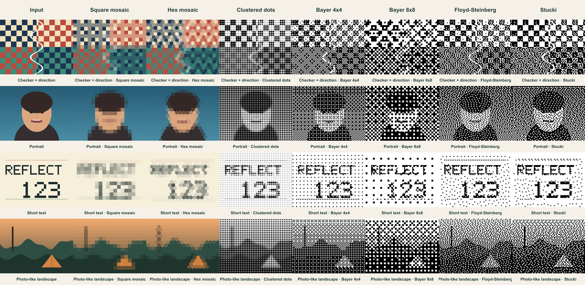
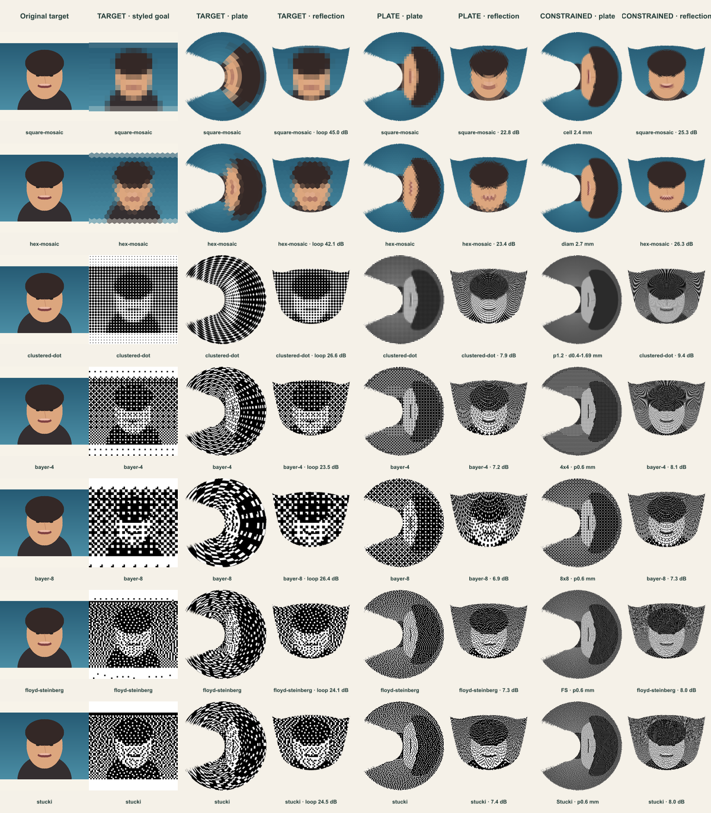

# Non-AI style lab

The style lab is an internal, deterministic research path. It is not wired to the customer editor, canonical plate renderer or production export. That separation is deliberate: a visual filter is not production-ready until its optical round trip and physical print coupon both pass.

## 本轮可直接评审的结果（2026-07）

本轮不只输出平面滤镜，而是让七组预设真实经过 `curved-cup-v3` 的同一套 LUT 和设计眼位闭环。四组完全程序化、可公开的测试图分别覆盖方向棋盘、人像、短文字和自然风景，不包含客户图片或第三方摄影素材。



下面的人像联系表从左到右分别展示：原始目标、`target` 域的风格目标/盘图/倒影、`plate` 域的盘图/倒影，以及 `plate-constrained` 参数搜索后的盘图/倒影。倒影只显示面向客户的最大可逆核心区，调试用顶部孤岛已被遮除。



其他统一案例：[方向棋盘](assets/style-lab/optical-domains/checker-contact-sheet.png)、[短文字](assets/style-lab/optical-domains/text-contact-sheet.png)、[自然风景](assets/style-lab/optical-domains/landscape-contact-sheet.png)。完整参数、选中候选、profile/LUT checksum、误差以及所有落盘样张和联系表的 SHA-256 位于 [`manifest.json`](assets/style-lab/manifest.json)。生成器会先核对公开 v3 profile、LUT、valid mask 和 core mask 的发布清单及校验和，避免误拿草稿或旧 LUT 做评审。

四类测试图的平均数字结果如下。`target loop` 是倒影相对“已风格化目标”的闭环 PSNR；后两列是倒影相对“原始目标”的 PSNR，所以第一列不能与后两列直接排名。PSNR 只用于同算法参数筛选，不代表主观美感、可读性或实物印刷质量。

| 风格 | target loop | plate 直接处理 | plate-constrained | 约束搜索增益 |
|---|---:|---:|---:|---:|
| 方形马赛克 | 44.46 dB | 19.44 dB | 22.17 dB | +2.74 dB |
| 六边形马赛克 | 41.90 dB | 20.00 dB | 22.77 dB | +2.77 dB |
| 聚集点半色调 | 27.27 dB | 8.33 dB | 10.26 dB | +1.92 dB |
| Bayer 4×4 | 24.35 dB | 8.02 dB | 9.02 dB | +1.00 dB |
| Bayer 8×8 | 26.99 dB | 7.74 dB | 8.31 dB | +0.57 dB |
| Floyd–Steinberg | 25.09 dB | 8.25 dB | 9.03 dB | +0.78 dB |
| Stucki | 25.53 dB | 8.58 dB | 9.23 dB | +0.64 dB |

目前建议优先 Review：

1. **方形马赛克**：颜色和轮廓最稳，适合作为首个面向客户的确定性风格；规则感强，但盘面单元经过反推后会拉伸。
2. **六边形马赛克**：与方形方案同样稳定，盘面更有装饰性；当前人像的受约束结果为 26.34 dB，略好于方形的 25.29 dB。
3. **聚集点半色调**：最像成熟印刷语言，图案辨识度直观。新版按圆点在方格内的真实覆盖面积反求点径，并允许暗部圆点合并到最多 `pitch × √2`，因此可以覆盖从纸白到实黑；但 plate 域的彩色原图 PSNR 本来就不适合衡量这种主动黑白化风格，应以人脸、文字和方向可读性为主。
4. **Floyd–Steinberg / Stucki**：短文字和边缘保留较好，纹理自然；0.6 mm 是请求节距，768 px 评审盘图会为避免低于下限而向上量化成约 0.713 mm，仍必须等实体打印条确认。
5. **Bayer 4×4 / 8×8**：重复矩阵非常明显，适合刻意的复古数字风格，不建议作为默认照片模式。4×4 在当前受约束参数网格中比 8×8 更稳定。

此处的 `plate-constrained` 已经可以运行，但它目前只是对一组物理参数做确定性穷举，并用设计眼位 8-bit sRGB 数值域的 RGB MSE 选最优解；它**还不是**逐单元优化颜色、点径和密度的生产级求解器。二值抖动搜索均选择了 0.6 mm 请求节距，说明数字闭环倾向更细图元，也说明实物打印能力将成为真正的约束。

## Contract

`src/rendering/styles` operates on a complete RGBA image rather than one pixel at a time. A saved recipe contains the provider ID and version, normalized numeric parameters, a 32-bit seed, processing domain and physical dimensions. `serializeStyleRecipe` emits a stable representation suitable for snapshots and content hashes.

The audited providers in this report are version 2. Their version was advanced together because conservative whole-pixel physical rounding changes the output of every physical-size provider; clustered-dot coverage and error-diffusion debt handling also changed. A version-1 recipe must therefore never be silently replayed with these bytes.

The execution domains have distinct meanings:

- `target`: style the desired reflection before the optical warp. Recognition is usually strongest; plate cells become geometrically distorted.
- `plate`: style the already-warped plate image. Plate cells remain regular; reflection fidelity usually falls.
- `plate-constrained`: compare deterministic plate-space candidates with a caller-supplied closed-loop optical loss. The generic executor and scoring seam are implemented, but no production optimizer is claimed yet.

Every provider preserves width, height and the source alpha channel. Fully transparent pixels are canonicalized to transparent black. The first-wave algorithms are deterministic and currently do not vary with `seed`; the seed is part of the recipe for later stochastic stippling and sampling providers.

## First-wave providers

| Provider | Parameters | Best early use | Main trade-off |
|---|---|---|---|
| Square mosaic | cell size in mm | Robust colour abstraction | Strong grid appearance |
| Hex mosaic | cell diameter in mm | More decorative colour tiling | Boundary cells are partial |
| Clustered-dot B/W halftone | pitch, min/max dot diameter in mm, gamma | Print-friendly tonal image | Loses colour; dark dots merge above ~78.5% coverage |
| Bayer ordered dither | 4x4 or 8x8 matrix, sample pitch in mm | Fast, stable graphic pattern | Visible repeating matrix |
| Floyd–Steinberg serpentine | physical sample pitch | Strong local detail | Noisier plate texture |
| Stucki serpentine | physical sample pitch | Smoother tonal diffusion | Wider error footprint |

The lab enforces provisional manufacturing limits of **0.4 mm minimum feature** and **0.6 mm minimum pitch**. These are research defaults, not a factory capability claim. Replace them only after the UV printer, coating and viewing-distance coupon is measured.

Ordered dithering, digital halftoning and error diffusion have mature non-AI precedents in [ImageMagick's quantization examples](https://usage.imagemagick.org/quantize/). Edge-preserving/cartoon rendering is available as a later control group through [OpenCV's NPR algorithms](https://docs.opencv.org/4.x/df/dac/group__photo__render.html), but those filters are less plate-specific than the first-wave set.

Research notes supporting the prioritisation:

- Floyd and Steinberg's original 1976 method propagates local quantisation error ([paper record and bibliographic data](https://isgwww.cs.uni-magdeburg.de/~stefans/npr/entry-Floyd-1976-AAS.html)); the lab mirrors the row kernel on alternating rows, matching the serpentine implementation documented in the ImageMagick examples above. Intermediate error is not clipped before palette selection, which avoids silently discarding tonal debt.
- Clustered dots keep minimum-dot and pitch as separate physical constraints. The current digital model is coverage-correct, but ink spread, primer, varnish and curing remain unknown; that is why no digital result is labelled print-stable without the coupon below.
- Weighted Voronoi stippling remains a strong second-wave candidate because it represents tone with well-spaced marks, but its iterative weighted centroid relaxation belongs in an offline worker ([Secord, Weighted Voronoi Stippling](https://www.cs.ubc.ca/labs/imager/tr/2002/secord2002b/)).

## Review artifacts

Run:

```text
pnpm style:review
```

The command procedurally generates checker/direction, portrait, short-text and photo-like landscape fixtures, applies every review preset and writes:

- `docs/assets/style-lab/review-contact-sheet.png`
- `docs/assets/style-lab/inputs/`
- `docs/assets/style-lab/outputs/`
- `docs/assets/style-lab/optical-domains/`
- `docs/assets/style-lab/manifest.json`

The manifest records every normalized recipe, selected constrained candidate, closed-loop metric, optical profile identity, published LUT evidence, and SHA-256 for every generated image. Fixtures contain no customer data or third-party imagery. Re-running the command produces byte-identical PNG and manifest hashes on the supported Node/Sharp toolchain.

## Millimetre and colour interpretation

- `plate` and `plate-constrained` parameters use the full **182.4924 mm** plate diameter. The review plate is 768×768 (about 0.2376 mm/px). All requested dimensions round **up** to whole pixels: the 0.4 mm feature guard becomes about 0.475 mm and the 0.6 mm pitch guard becomes about 0.713 mm in these review images. This prevents a low-resolution review raster from silently drawing a sub-limit mark.
- `target` parameters use the published v3 design frame (**84×76 mm**), not the plate diameter. Square pixel kernels conservatively use the lower of the horizontal/vertical pixel densities. After optical warping their printed plate dimensions vary, so a target-domain “mm” value is a design-eye scale, **not** a minimum printed feature guarantee.
- Current providers process 8-bit sRGB byte values and preserve alpha. The PSNR table uses the same byte domain on a 3×3-eroded reversible core. It is suitable for deterministic candidate ranking, not for perceptual quality, colour-managed production or an ICC-calibrated print claim.

## Printing limits and next coupon

The **0.4 mm minimum feature** and **0.6 mm minimum pitch** are deliberately conservative software guards, not measured UV-printer capabilities. Physical UV ink, primer, varnish and curing can enlarge dots or close gaps. The first factory coupon should therefore include isolated dots/lines at 0.4, 0.5, 0.6, 0.8 and 1.0 mm; pitches at 0.6, 0.8, 1.0, 1.2 and 1.5 mm; positive and negative versions; neutral ramps; and the same marks in radial/tangential orientations. Record printed diameter/gap and reflection readability before changing these constants.

## Recommended review

1. Reject any style that loses arrow direction, short text structure or the portrait's eyes/mouth at the design eye.
2. Compare target-space and plate-space results through the same immutable optical profile; do not judge only the flat plate.
3. For the strongest two styles, search a small deterministic physical-parameter grid with `plate-constrained` and rank closed-loop SSIM/edge retention.
4. Print a physical coupon containing minimum features and gaps before exposing parameters to customers.

## Documented second wave

- Edge-guided Delaunay low-poly rendering: useful for a designed social-media aesthetic, but it needs a reviewed triangulation dependency or an in-house implementation.
- Weighted Voronoi stippling: high illustration quality and naturally supports a seed, but iterative centroid relaxation is slower and belongs in an offline worker. The reference method is [Weighted Voronoi Stippling](https://www.cs.ubc.ca/labs/imager/tr/2002/secord2002b/secord.2002b.pdf).

Neither second-wave method is registered as an available provider, so the application cannot accidentally advertise an unimplemented style.
